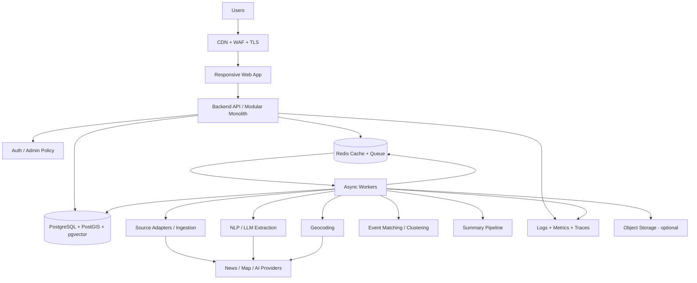

# System Architecture

## Architecture decision

Dùng **modular monolith + asynchronous worker architecture** cho MVP.

Lý do:

- ít operational overhead;
- dễ debug;
- vẫn scale ngang API và worker độc lập;
- phù hợp workload bất đồng bộ của ingestion/NLP/geocoding/clustering;
- có đường nâng cấp thành service riêng khi bottleneck thực tế xuất hiện.

## Logical architecture

## Trust boundaries

1. Browser -> public edge.
2. Public API -> application.
3. Application -> database/cache.
4. Worker -> external sources.
5. LLM input/output boundary.
6. Admin -> privileged operations.

## Runtime topology

### Public

- CDN/WAF;
- static frontend;
- public read API.

### Private

- API runtime;
- worker runtime;
- PostgreSQL;
- Redis;
- secret manager.

Database và Redis không public internet.

## Scaling strategy

### Scale first

1. CDN/cache.
2. API replicas.
3. Worker replicas theo queue.
4. DB read optimization/indexes.
5. Redis.

### Scale later

Chỉ tách thành service riêng khi một module có:

- tải khác biệt rõ ràng;
- failure domain cần độc lập;
- deployment cadence riêng;
- resource profile riêng;
- bottleneck đã đo được.

Candidate future services:

- ingestion;
- NLP/event extraction;
- geocoding;
- clustering;
- trend engine.

## Request rule

HTTP request phục vụ user không được block chờ:

- crawling;
- LLM extraction;
- geocoding hàng loạt;
- event clustering hàng loạt.

Các tác vụ này phải đi qua queue/worker.
