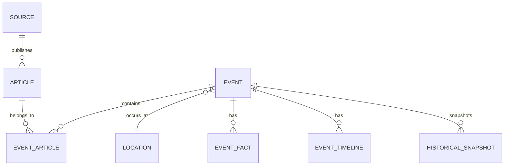

# Data Architecture

## Primary database

PostgreSQL + PostGIS.

Optional pgvector cho similarity nếu cần.

## Core entities

```text
Source
Article
Location
Event
EventArticle
EventFact
EventTimeline
HistoricalSnapshot
ProcessingJob
```

## Relationships



## Required indexes

### articles

- unique/candidate index on canonical URL;
- content hash;
- published_at;
- source_id + published_at.

### events

- occurred_at;
- last_updated_at;
- category;
- status;
- source_count/article_count where useful;
- PostGIS spatial index on geometry.

### event_articles

- event_id;
- article_id;
- unique(event_id, article_id).

## Geospatial

Store a canonical geometry/point using PostGIS.

Never infer street-level precision from province-level data.

Store:

- latitude/longitude;
- resolved address;
- location level;
- location confidence;
- resolution provider/method.

## Historical snapshots

Snapshot counts/metrics over time instead of overwriting everything.

Required baseline fields:

```text
captured_at
article_count
source_count
last_seen_at
```

## Data retention

Define retention by data class before production:

- raw metadata;
- article excerpts;
- processing logs;
- audit logs;
- analytics snapshots.

Do not retain more content than necessary.
